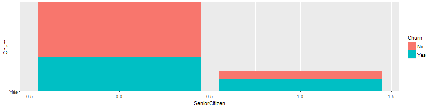
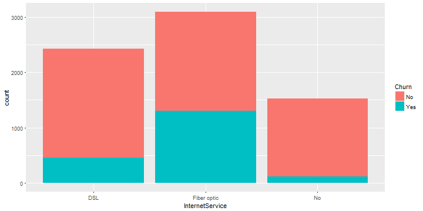
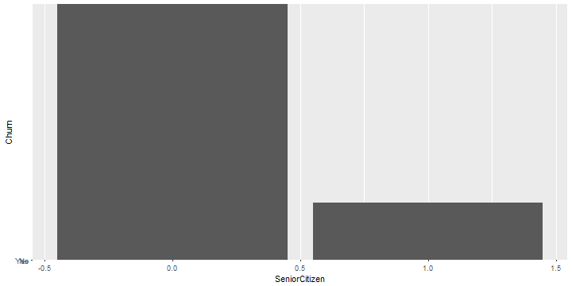

## Phase 1 -- Transformation and Description of Data

<style>
body {
  background-color: #000;
}
.quiz-option label{
  display: inline;
  font-size: 1em;
}
ul.nav li::before { content: ""; }  
ul.nav li{ font-size: 18px; line-height: 24px;}
</style>


1. The dataset was retrieved from IBM website which is used for analyzing whether customer will retain with the company or not.
2. The data frame consists of 7043 observations  of  21 variables.
3. This data set provides info to help us predict behavior to retain customers and to develop customer retention programs.

---

## Phase 2 -- Exploratory Data Analysis
### 1.Data split by Gender 
1. Inference - Over all Female count (3488) > Male (3555)

```
## 
## Female   Male 
##   3488   3555
```


---

### 2.Churn by Gender
2. Inference - Churn rate is slightly high with Female Gender

```
##         
##            No  Yes
##   Female 2549  939
##   Male   2625  930
```


---

### 3.Churn by SeniorCitizen 
1. Inference - Senior citizen Churn is comparitively less

```
##    
##       No  Yes
##   0 4508 1393
##   1  666  476
```



---

### 4.Churn because of InternetService
1. Inference - Churn rate was high in Fiber Optic based Internet Connection

```
##              
##                 No  Yes
##   DSL         1962  459
##   Fiber optic 1799 1297
##   No          1413  113
```



---

### 5.Churn based on Contract type
1. Inference -  Churn rate is high in Month-to-Month contarct and churn is less in Two years contract

```
##                 
##                    No  Yes
##   Month-to-month 2220 1655
##   One year       1307  166
##   Two year       1647   48
```


---

### 6.Churn based on Dependent status
1. Inference - Churn on dependents status is less

```
##   Churn count(*)
## 1    No     1784
## 2   Yes      326
```

### 7.Average tenure of the customer when they are dependent
1. Inference - Avergae Tenure of the customeris more when they have dependent 
and for dependent yes and tenure average is 38

```
##   Dependents   tenure
## 1         No 29.80600
## 2        Yes 38.36825
```

---

### 8.Average tenure of a customer who's status of Partner  yes
1. Inference - Highest tenure is marked AS 42.01764 when the partner status is yes

```
##   Partner   tenure
## 1      No 23.35787
## 2     Yes 42.01764
```



---

### 9.Churn vs Tenure
1. Inference - As the tenure progresses customer who move out of the company are very less.


---

### 10.Contract Vs Tenure
1. Inference - As the tenure progresses customers migrates from monthly to Yearly contract.


---

## Phase 3 - Hypothesis testing

### Hypothesis 1            :   Tenure is longer if the partner status is yes
1. Hypothesis test type    :   One Sample 1 sided t-test
2. Alternate Hypothesis Ha :   Longer tenture if the partner status is yes
3. Null Hypothesis         :   Partner status , plays no difference
4. Since the P value is < 0.05, reject H0 and significant difference is there when the partner status is yes


```
## 
## 	One Sample t-test
## 
## data:  ii$tenure
## t = 17.272, df = 3401, p-value < 2.2e-16
## alternative hypothesis: true mean is greater than 35
## 95 percent confidence interval:
##  41.34913      Inf
## sample estimates:
## mean of x 
##  42.01764
```

---

### Hypothesis 2            :   Tenure vs Gender
1. Hypothesis test type    :   One Sample 2 sided t-test
2. Alternate Hypothesis Ha :   Longer the tenture based on gender
3. Null Hypossis           :   Gender makes no difference in Tenure
4. Inference :  No difference in the tenture length because of the gender
Since the P value is > 0.05, Cannot reject H0 and so there is no difference in tenure becuase of the gender


```
## 
## 	Welch Two Sample t-test
## 
## data:  raw_data$tenure[raw_data$gender == "Female"] and raw_data$tenure[raw_data$gender == "Male"]
## t = -0.4285, df = 7040.1, p-value = 0.6683
## alternative hypothesis: true difference in means is not equal to 0
## 95 percent confidence interval:
##  -1.3981810  0.8965692
## sample estimates:
## mean of x mean of y 
##  32.24455  32.49536
```

---

### Hypothesis 3            :   Tenure is longer if the partner status is yes
1. Hypothesis test type    :   One Sample 2 sided t-test
2. Alternate Hypothesis Ha :   There is a difference in tenture becuase the partner status is yes
3. Null Hypthesis          :   No difference in tenure because the partner status is Yes
4. Inference :  p  value is very less than 0.05 alpha,  so reject H0 and accept Ha. There is a significant difference in the tenure because of the partner status is yes


```
## 
## 	Welch Two Sample t-test
## 
## data:  raw_data$tenure[raw_data$Partner == "Yes"] and raw_data$tenure[raw_data$Partner == "No"]
## t = 34.341, df = 6881.3, p-value < 2.2e-16
## alternative hypothesis: true difference in means is not equal to 0
## 95 percent confidence interval:
##  17.59460 19.72494
## sample estimates:
## mean of x mean of y 
##  42.01764  23.35787
```

---

### Hypothesis 4            :   Average tenure of senior citizen is more than 30
1. Hypothesis test type    :   One Sample 1 sided t-test
2. Alternate Hypothesis Ha :   Tenure of senior citizen is more than 30
3. Null Hypossis           :   Tenure of senior citizen is more not than 30
4. Inference :  Mean of tenure is greater when the partner status is yes. Since the P value is < 0.05, reject H0 and significant difference is there when the partner status is yes


```
## 
## 	One Sample t-test
## 
## data:  sc$tenure
## t = 46.517, df = 1141, p-value < 2.2e-16
## alternative hypothesis: true mean is greater than 0
## 95 percent confidence interval:
##  32.11767      Inf
## sample estimates:
## mean of x 
##  33.29597
```

---

### Hypothesis 5            :   Churn based on gender
1. Hypothesis test type    :   Chi square
2. Alternate Hypothesis Ha :   Churn is based on gender
3. Null Hypossis           :   Churn is not based on gender
4. Inference :  P value > Alpha 0.05, Cannot reject H0, accpt H0.
Churn is not gender based


```
## 
## 	Pearson's Chi-squared test with Yates' continuity correction
## 
## data:  ta
## X-squared = 0.48408, df = 1, p-value = 0.4866
```

---

### Hypothesis 6            :   Churn based on Senior citizen status
1. Hypothesis test type    :   Chi square
2. Alternate Hypothesis Ha :   Churn is based on gender
3. Null Hypossis           :   Churn is not base don gender
4. Inference :  P value < Alpha 0.05,  reject H0, Accept  Ha  Churn based on senior citizen staus


```
## 
## 	Pearson's Chi-squared test with Yates' continuity correction
## 
## data:  snc
## X-squared = 159.43, df = 1, p-value < 2.2e-16
```

---

### Hypothesis 7            :   Churn based on streaming status
1. Hypothesis test type    :   Chi square
2. Alternate Hypothesis Ha :   Churn is based on streaming status
3. Null Hypossis           :   Churn is not based on streaming status
4. Inference :  P value < Alpha 0.05,  reject H0, Accept  Ha.Churn based on streaming  staus


```
## 
## 	Pearson's Chi-squared test
## 
## data:  tr
## X-squared = 374.2, df = 2, p-value < 2.2e-16
```

---

### Hypothesis 8            :   Churn based on StreamingMovies status
1. Hypothesis test type    :   Chi square
2. Alternate Hypothesis Ha :   Churn is based on StreamingMovies status
3. Null Hypossis           :   Churn is not based on StreamingMovies status
4. Inference :  P value < Alpha 0.05,  reject H0, Accept  Ha.Churn based on StreamingMovies  staus


```
## 
## 	Pearson's Chi-squared test
## 
## data:  tr1
## X-squared = 375.66, df = 2, p-value < 2.2e-16
```

---

### Hypothesis 9            :   Monthly charges are varied based on gender
1. Hypothesis test type    :   One Sample 2 sided t-test
2. Alternate Hypothesis Ha :   Monthly charges varied based on gender
3. Null Hypossis           :   Monthly charges not varied based on gender
4. Inference :  No differenc ein the tenture length because of the gender.Since the P value is > 0.05,  cannot reject H0 and monthly charges are not varied based on gender so reject  Alternate hypothesis


```
## 
## 	Welch Two Sample t-test
## 
## data:  raw_data$MonthlyCharges[raw_data$gender == "Female"] and raw_data$MonthlyCharges[raw_data$gender == "Male"]
## t = 1.2227, df = 7038.9, p-value = 0.2215
## alternative hypothesis: true difference in means is not equal to 0
## 95 percent confidence interval:
##  -0.5289426  2.2824640
## sample estimates:
## mean of x mean of y 
##  65.20424  64.32748
```

---


### Hypothesis 10           :   Churn is more because of Internet Service
1. Alternate Hypothesis Ha :   Churn is based on Internet Service status
2. Null Hypossis           :   Churn is not based on Internet Service status
3. Hypothesis test type    :   Chi square
4. Inference :  P value < Alpha 0.05,  reject H0, Accept  Ha. Churn based on Internet Service  status


```
## 
## 	Pearson's Chi-squared test
## 
## data:  tr11
## X-squared = 732.31, df = 2, p-value < 2.2e-16
```

---
## END


